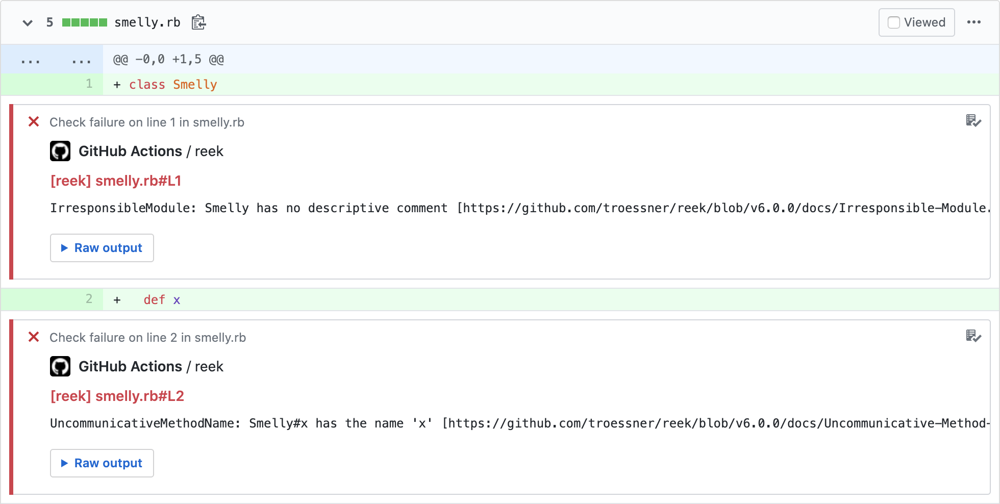
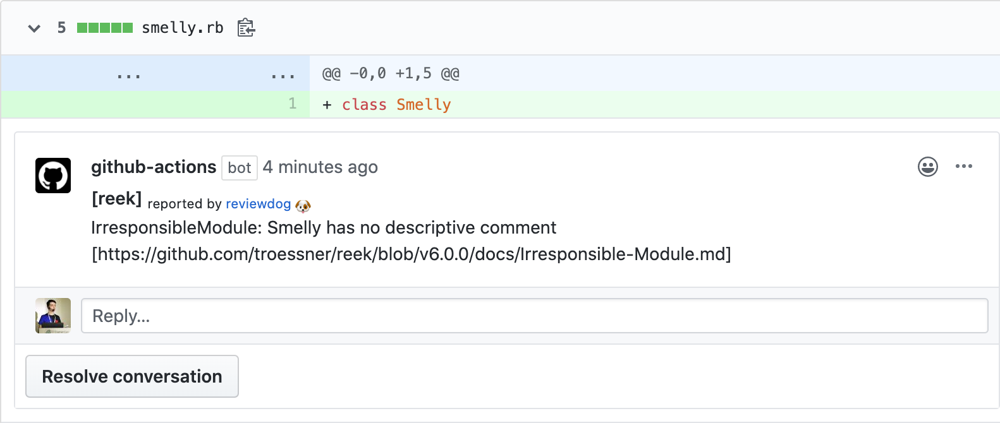

# GitHub Action: Run reek with reviewdog 🐶

[](./LICENSE)
[](https://github.com/reviewdog/action-reek/actions?query=workflow%3Adepup)
[](https://github.com/reviewdog/action-reek/actions?query=workflow%3Arelease)
[](https://github.com/reviewdog/action-reek/releases)
[](https://github.com/haya14busa/action-bumpr)

This action runs [reek](https://github.com/troessner/reek) with
[reviewdog](https://github.com/reviewdog/reviewdog) on pull requests to improve
code review experience.

## Examples

### With `github-pr-check`

By default, with `reporter: github-pr-check` an annotation is added to the line:



### With `github-pr-review`

With `reporter: github-pr-review` a comment is added to the Pull Request Conversation:



## Inputs

### `github_token`

`GITHUB_TOKEN`. Default is `${{ github.token }}`.

### `reek_version`

Optional. Set reek version. Possible values:
* empty or omit: install latest version
* `gemfile`: install version from Gemfile (`Gemfile.lock` should be presented, otherwise it will fallback to latest bundler version)
* version (e.g. `6.0.0`): install said version

### `reek_flags`

Optional. Reek flags. (`reek --single-line . <reek_flags>`)

### `tool_name`

Optional. Tool name to use for reviewdog reporter. Useful when running multiple
actions with different config.

### `level`

Optional. Report level for reviewdog [`info`, `warning`, `error`].
It's same as `-level` flag of reviewdog.

### `reporter`

Optional. Reporter of reviewdog command [`github-pr-check`, `github-pr-review`].
The default is `github-pr-check`.

### `filter_mode`

Optional. Filtering mode for the reviewdog command [`added`, `diff_context`, `file`, `nofilter`].
Default is `added`.

### `fail_level`

Optional. If set to `none`, always use exit code 0 for reviewdog.
Otherwise, exit code 1 for reviewdog if it finds at least 1 issue with severity greater than or equal to the given level.
Possible values: [`none`, `any`, `info`, `warning`, `error`]
Default is `none`.

### `fail_on_error`

Deprecated, use `fail_level` instead.
Optional.  Exit code for reviewdog when errors are found [`true`, `false`]
Default is `false`.

### `reviewdog_flags`

Optional. Additional reviewdog flags.

## Example usage

```yml
name: reviewdog
on: [pull_request]
jobs:
  reek:
    name: runner / reek
    runs-on: ubuntu-latest
    steps:
      - name: Check out code
        uses: actions/checkout@11bd71901bbe5b1630ceea73d27597364c9af683 # v4.2.2
      - uses: ruby/setup-ruby@1a615958ad9d422dd932dc1d5823942ee002799f # v1.227.0
        with:
          ruby-version: 3.0.0
      - name: reek
        uses: reviewdog/action-reek@f748c368e3a04fcb435e518067ab722ad228d7a9 # v1.19.2
        with:
          reek_version: gemfile
          reporter: github-pr-review # Default is github-pr-check
```

## Sponsor

<p>
  <a href="https://evrone.com/?utm_source=action-reek">
    
  </a>
</p>

## License

[MIT](https://choosealicense.com/licenses/mit)
